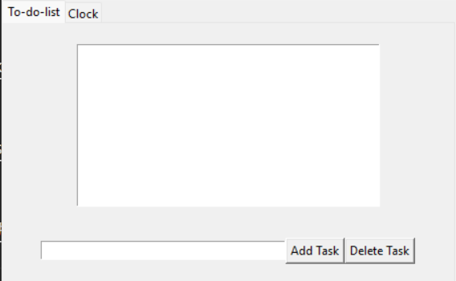
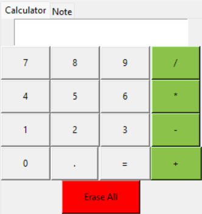

# Functions

hole4 has 4 functions:

- ✔️[To-do-list](#to-do-list)  
Tasks managing

- ✔️[Clock](#clock)  
Show the time

- ✔️[Notes](#notes)  
For take some notes

- ✔️[Calculator](#calculator)  
For calculate some operations

## ✔️ To-do-list

The to-do-list function is very simple to use :  
  

#### 🗃️ Add task
On the ***bottom entry***, type the name of your task, then click on the button **add task** to add the task.  

#### 🗑️ Delete task
Click on the task you want to delete, then click on the **delete button** to delete the task.  

## 🕰️ Clock
This function just show the time (an upgrade for the clock function coming soon)

## 🖋️ Notes
Do you think this functions need a def ?

## 🧮 Calculator
  
**Simple and minimalist**